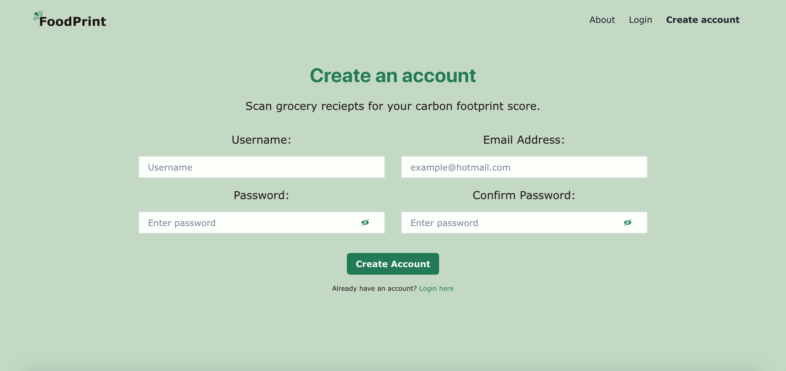
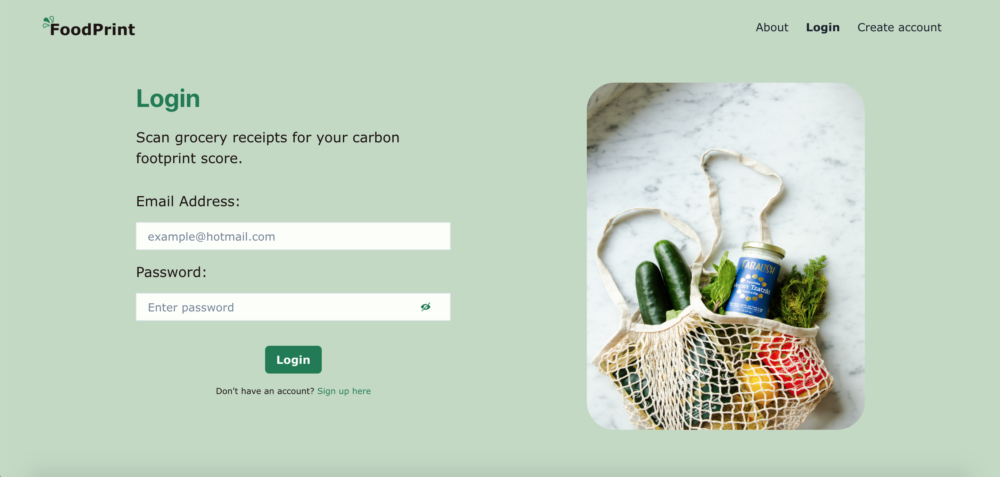
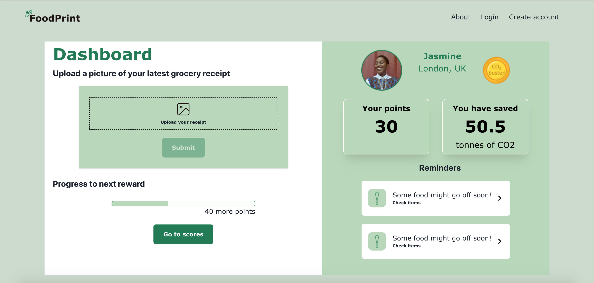
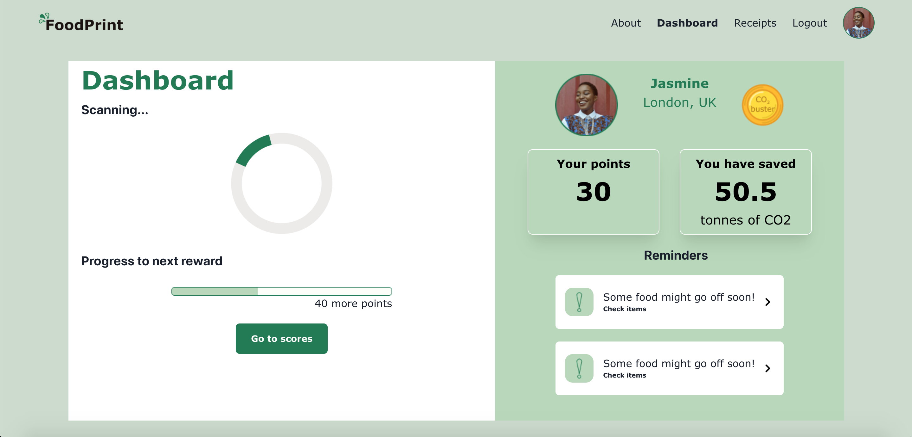
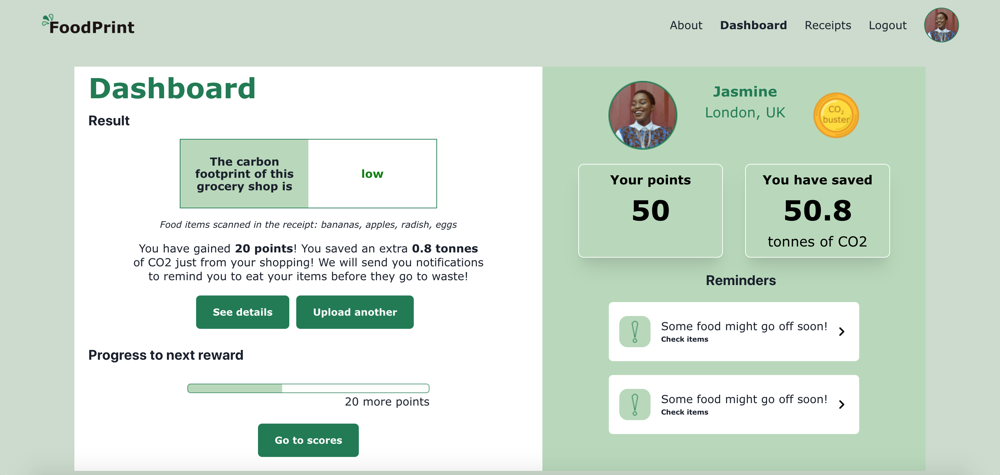
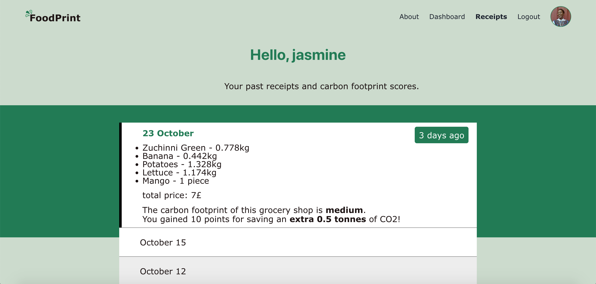

# Athena October 2022 Hackathon - FoodPrint

Our submission for the Athena Hackathon (virtual, October 2022) on the theme "How can households reduce their carbon footprint?".

FoodPrint is a web app that scans groceries receipts and detects high carbon footprint. The app also sends reminders to avoid food waste, tracks users' previous receipts scans, and uses gamification (with points and special badges) to increase user engagement.

---> [video presentation](https://www.youtube.com/watch?v=QaSFLCIoxgs)

## App Features
- Scans users’ groceries receipt to calculate the food items’ carbon footprint 
- Sends reminders to users to avoid food waste
- Awards points for low carbon footprint food shopping to encourage users 
- Tracks previous receipts’ scans to help users’ track their impact and food spending

We built our app with the security of our users in mind: we use cookie session to check users' authentication and hash users' passwords with the cryptography library bycryptjs before storing them in the database.

## Tech stack
React, Node.js, Express, PostgreSQL, OCR API <br />

## Challenges and accomplishments

It was challenging to detect text in the receipt image the user uploads and determine if the text found referred to a food item. To overcome this technical challenge, we researched OCR (Optical Character Recognition) APIs and found a suitable API we could use.

Another challenge was to determine which food items had a high carbon footprint and how we could calculate a total score for a supermarket receipt. We researched food production and its impact on the environment using official data and scientific investigations. Using this data, we created 3 scores types - 'low', 'medium',  'high' - and coded an algorithm in the backend to determine the score of each receipt scan.

## Future improvements
- Implementing reminders via mobile messaging (SMS, WhatsApp, Telegram)
- Connecting users to local food producers with search and messaging features

## Hackathon 
We teamed up and worked remotely across different time zones for the Hackathon. We conceptualized and built the app from scratch in only 30 hours. We had a great time and we are proud of the result :)

## Local installation 

- Clone the repository 

- Install dependencies 
```bash
npm install
```

- Set up a PostgreSQL database:

Set up a PostgreSQL database (download [PostgreSQL](https://www.postgresql.org/download/) if necessary) and add the database credentials in a `.env` file. Once the database is created, connect to your database `psql -d databaseName`, and create the tables in `backend/database.sql`.
- Run a development server:

Concurrently in 2 different tabs:
```bash
npm start
```

```bash
cd client 
npm start
```

## Credits
Audrey (developer), Sowjanya (developer), Kate (developer), Nadia (UI/UX designer), Adeola (UI/UX designer)

## Screenshots 







